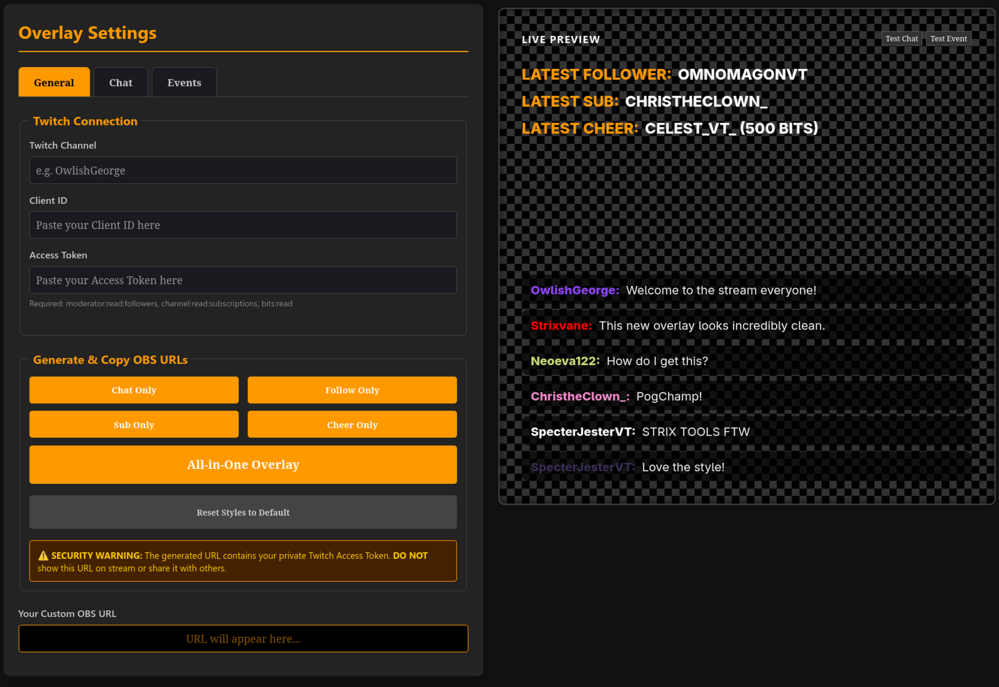

# StrixTools Overlay

StrixTools is a lightweight, high-performance, and highly customizable Twitch overlay suite designed for OBS and other streaming software. Built with modern web technologies, it provides a seamless chat experience and real-time event tracking without the need for complex installations or backend servers.

## Features

- **Deep Customization:** Adjust typography, colors, background opacity, "pillbox" styling, and advanced borders directly from the settings dashboard.
- **Live Events (Twitch EventSub):** Instant tracking of new Followers, Subscribers, and Cheers using Twitch's latest WebSocket-based EventSub API.
- **Enhanced Chat:** Modern chat overlay with support for Twitch emotes and "pillbox" message layouts.
- **Local Persistence:** Your settings are automatically saved in your browser's local storage—no need to re-configure after closing the page.
- **Live Preview & Testing:** See your changes in real-time and use built-in "Test Chat" and "Test Event" buttons to verify your layout before going live.
- **Modular or All-in-One:** Generate a single URL for the full suite or individual URLs for specific components (e.g., Chat only, Follower only).

## Setup Instructions

### 1. Configure the Overlay
1. Open `settings.html` in your web browser.
2. **General Tab:** Enter your **Twitch Channel** name.
3. **Authentication:** Provide a **Client ID** and **Access Token**. (See below for instructions on how to generate these).
4. **Customization:** Use the **Chat** and **Events** tabs to style the overlay. Your changes will appear instantly in the **Live Preview** pane.
5. **Testing:** Click "Test Chat" or "Test Event" in the preview pane to see your animations and styles in action.
6. **Generate URL:** Scroll down and click **All-in-One Overlay** (or a specific component button). The custom URL will be generated and copied to your clipboard.

### 2. Add to OBS
1. In OBS, add a new **Browser Source**.
2. **URL:** Paste the generated URL from your clipboard.
3. **Dimensions:** Set the width and height to your preference.
4. **Optimization:** Check "Shutdown source when not visible" for best performance.
5. **Update:** Whenever you change settings in `settings.html`, generate a new URL, update the source in OBS, and refresh the cache.

## How to Get Your Twitch Access Token

To track live events and read chat, the overlay needs a secure connection to your Twitch channel.

1. Go to [Twitch Token Generator](https://twitchtokengenerator.com/) (or another trusted developer tool).
2. Select **Custom Scope Token**.
3. Enable the following mandatory scopes:
   - `moderator:read:followers`
   - `channel:read:subscriptions`
   - `bits:read`
4. Click **Generate Token** and authorize the application.
5. Copy the **Access Token** and **Client ID**.
6. Paste these into the **General** tab in `settings.html`.

> [!CAUTION]
> **SECURITY WARNING:** The generated OBS URL contains your private Access Token. **NEVER** show this URL on stream, share it with others, or commit it to a public repository. If your token is compromised, generate a new one immediately.

## Project Structure

- `index.html`: The main overlay renderer used in OBS.
- `settings.html`: The visual configuration dashboard and previewer.
- `assets/`: Image resources and project screenshots.
- `js/modules/`: Core logic for Twitch API connection (`twitch.js`), Chat handling (`chat.js`), and Event tracking (`events.js`).
- `styles/`: CSS definitions for the overlay themes and settings UI.
- `js/config.js`: Default settings and configuration schema.

## Technical Details

- **Twitch Integration:** `tmi.js` for IRC chat and Twitch EventSub (WebSockets) for real-time notifications.
- **Emotes:** Parsed using `emotettv` for high-quality emote rendering.
- **Styling:** Dynamic CSS generation based on your visual configuration.
- **Storage:** Web LocalStorage for configuration persistence.

---

For a full list of recent updates and changes, see the [CHANGELOG.md](CHANGELOG.md).
